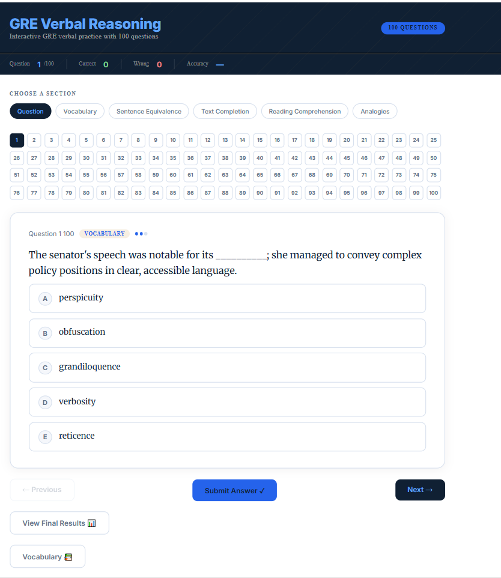

# GRE Verbal Practice App  

This project started as a personal challenge.

I realized that simply memorizing vocabulary wasn't an engaging way for me to learn. Also, I've always enjoyed creating something useful alongside whatever I'm learning. While preparing for the GRE, I found that reviewing vocabulary with traditional flashcards quickly became repetitive and boring. So instead of relying on flashcards and books, I challenged myself to build my own app that is interactive, engaging, and more enjoyable to use.

This project is the result.

The app includes more than 100 practice questions covering:

- Vocabulary
- Sentence Equivalence
- Text Completion
- Reading Comprehension

Each question includes explanations and study tips to reinforce learning rather than simply revealing the correct answer.
